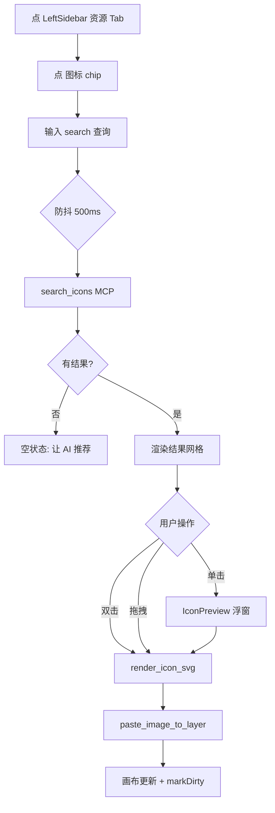
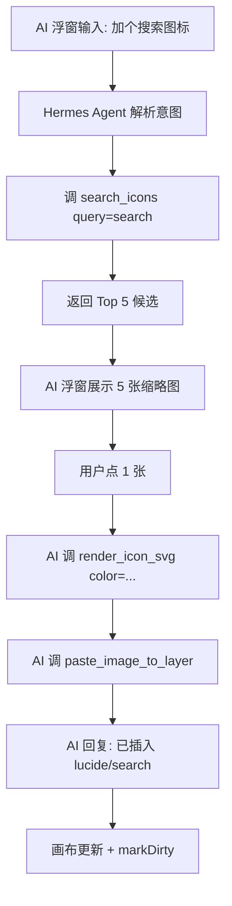
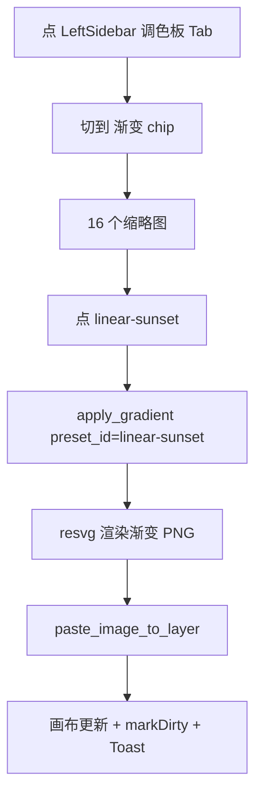

# OpenPaint · 资产库与开箱即用体验需求文档

**版本**：v0.1.0（草案）｜**状态**：待评审｜**作者**：全栈 + 产品｜**最后更新**：2026-09-01

> 本文档对应 v0.2.0 里程碑，把"是否内置笔刷库 / 模板库 / 图标库"的战略讨论从设计提案升级为**可执行的需求规格**。
> 核心结论：**不做 paint.net 风格的 100 个 SVG 笔刷 + 100 个 PSD 模板；做 AI 原生的 Iconify 集成 + 8 PNG 默认画刷 + 调色板 / 渐变预设 + 一组 MCP 工具**，让 AI 把这些资源"按需生成 / 编排"，而不是把 15 MB 静态资源塞进安装包。
> 关联设计文档：[OpenPaint 项目说明书.md](../OpenPaint%20项目说明书.md) §1.4 / §4、[OpenPaint 技术设计文档.md](../OpenPaint%20技术设计文档.md) §3.4 / §6.5、[OpenPaint 前端设计说明书.md](../OpenPaint%20前端设计说明书.md) §6。
> 测试用例命名空间：`AST-xxx`（Asset），与现有 `ONB-xxx` / `TC-xxx` 并列。

---

## 0. 背景与战略决策

### 0.1 真实问题

OpenPaint 桌面端 v0.1.0 已通过完整审计（38 Rust + 178 前端测试通过），主流程（选图 → AI 生成 → 落回画布 → 保存）跑通，但**首启动用户的"零资源焦虑"显著**：

| 场景        | paint.net / Photoshop 用户预期   | OpenPaint 现状                         |
| ----------- | -------------------------------- | -------------------------------------- |
| 插入图标    | "工具 → 图标库 → 选一个拖到画布" | ❌ 无任何图标资源                      |
| 切换笔刷    | "工具 → 笔刷 → 100 种纹理"       | ⚠️ 仅 1 种默认圆头                     |
| 换色 / 配色 | "调色板 → Material / 主题"       | ⚠️ 仅 8 色硬编码色板                   |
| 套用模板    | "文件 → 从模板新建 → 50 种"      | ⚠️ 仅空白画布                          |
| AI 辅助     | （无对照）                       | ✅ 已具备 10 个 MCP 工具 + 多 LLM 接入 |

差距的真实含义：**不是"功能数量"少，而是"开箱可玩性"低**。用户首次启动，看不到能用的现成素材，会立刻怀疑"这工具到底能干什么"。

### 0.2 战略抉择：不要做什么

| 候选方案                  | 体积     | AI 杠杆率   | 决策                       | 理由                                                             |
| ------------------------- | -------- | ----------- | -------------------------- | ---------------------------------------------------------------- |
| 100 个 SVG 笔刷           | ~ 5 MB   | 中          | ❌ 不做                    | SVG 笔刷"质感"远不如 PNG；用户嫌少还是嫌多都尴尬；AI 30 秒可生成 |
| 100 个 PSD 风格 JSON 模板 | ~ 10 MB  | 低          | ❌ 不做                    | 用户实际去稿定 / Figma 找模板；静态资源池注定落后                |
| Iconify **全量 SVG 索引** | ~ 100 MB | 🔥 **极高** | ✅ **做**（精简版 < 2 MB） | 唯一差异化卖点——AI 可调用                                        |
| 8 个高质量 PNG 默认画刷   | ~ 500 KB | 中          | ✅ 做                      | 兜底即开即用，AI 可扩展                                          |
| 4 套调色板 + 16 渐变预设  | ~ 100 KB | 中          | ✅ 做                      | 顺手做，零成本，AI 可编排                                        |
| **合计安装包增长**        |          |             | **< 3 MB**                 | 比 paint.net 的资源池小 100 倍                                   |

### 0.3 目标与非目标

#### 0.3.1 目标

- **首启动到"插入第一个可用素材"的时间 ≤ 30 秒**（图标 / 画刷 / 调色板任一）。
- **MCP 工具集扩展到 13 个**（新增 `search_icons` / `render_icon_svg` / `apply_palette` / `apply_gradient`），AI 可通过自然语言调用。
- **不增加 .msi / .dmg 安装包体积超过 3 MB**。
- **建立"AI 生成 → 用户保存到资产库"闭环**（与现有 Gallery 互通）。

#### 0.3.2 非目标（本期不做）

- 不引入完整 PSD / Sketch / Figma 文件格式导入（R-T07 候选）。
- 不做云端资产市场（R-A03 关联）。
- 不做"用户自制画刷的 UI 编辑器"（仅暴露 MCP 工具 `create_brush`，UI 在 W11+ 评估）。
- 不引入国际化（i18n）框架（R-T02），文案继续中文。

### 0.4 关键差异化叙事

> **唯一内置 Iconify 图标库的 AI 设计工作台。**
> 用户说"加个 Twitter 图标"，AI 调用 `search_icons({query: "twitter"})` → 命中 Lucide / Heroicons → 调用 `render_icon_svg` 拿到 SVG → 调用 `paste_image_to_layer` 落到画布。**这是 paint.net / Photoshop 永远做不到的事——因为它们没有 AI，没有 MCP。**

---

## 1. 用户故事（User Stories）

### US-AST-1：插入图标（设计师手动）

> **作为** 设计师
> **我希望** 在画布侧栏点开"图标"面板，搜索并拖一个 Lucide 图标到画布
> **以便** 不用切到 Illustrator / Figma

**验收标准**

- [ ] LeftSidebar 新增"图标"分类 Tab，点击展开图标搜索面板。
- [ ] 输入框支持中文 / 英文 / 拼音，500ms 防抖触发 `search_icons`。
- [ ] 结果按 style 分组（Lucide / Material / Tabler 等），每组最多展示 30 个。
- [ ] 单击 → 预览浮窗（带颜色 / 尺寸控件）；双击 → 落到当前图层。
- [ ] 拖拽缩略图到画布区域 = 同"双击"。

### US-AST-2：AI 找图标（AI 自动）

> **作为** 用户
> **我希望** 在 AI 助理里说"加个搜索图标，灰色"
> **以便** AI 自动帮我找到合适图标并放好

**验收标准**

- [ ] Hermes Agent 解析"图标 / icon"关键词 → 自动调用 `search_icons({query: "search", style: "lucide"})`。
- [ ] 命中多个 → AI 在浮窗展示 Top 3 候选缩略图。
- [ ] 用户选 1 个 → AI 调 `render_icon_svg(icon_id, color="#888888", size=64)` → 调 `paste_image_to_layer` → 落画布。
- [ ] 整链路耗时 ≤ 5 秒（不含网络）。

### US-AST-3：选择画刷（兜底手动）

> **作为** 用户
> **我希望** 在 CanvasToolbar 切画刷时有 8 种基础笔刷可选
> **以便** 至少不会"无米之炊"

**验收标准**

- [ ] 画刷选择器显示 8 种 PNG 笔刷缩略图（圆头 / 软边 / 粉笔 / 喷枪 / 水彩 / 油画厚涂 / 马克笔 / 模糊）。
- [ ] 鼠标悬停显示笔刷名 + 适用场景。
- [ ] 选中后画布光标实时切换到该笔刷预览。

### US-AST-4：AI 生成自定义画刷（v0.3+）

> **作为** 高级用户
> **我希望** 让 AI "帮我做一个像羽毛的笔刷"
> **以便** 不被内置画刷限制

**验收标准**（v0.3.0 实施，v0.2 仅注册 MCP 工具不做 UI）

- [ ] MCP 工具 `create_brush_from_prompt({prompt, name})` 已注册。
- [ ] 调用后生成 256×256 PNG，存到 `~/.openpaint/brushes/{uuid}.png`。
- [ ] 返回 `{brush_id, thumbnail_base64, file_path}`。
- [ ] canvasStore 监听 `brushes-updated` 事件，新增项自动出现在画刷选择器。

### US-AST-5：应用调色板（一键换色）

> **作为** 用户
> **我希望** 一键把整套配色方案应用到当前画布
> **以便** 不用一个个像素改

**验收标准**

- [ ] TopBar 新增"调色板"按钮，弹出调色板面板（4 套预设：Material / Tailwind / Pastel / Mono）。
- [ ] 单击某个色块 → 设为当前画笔颜色。
- [ ] 单击调色板名 → "应用调色板"按钮 → 调用 `apply_palette({name, layer_id})`。
- [ ] "应用"是把调色板 5-7 个颜色依次绘制为色块条叠加在图层底部（不破坏现有像素）。

### US-AST-6：应用渐变

> **作为** 用户
> **我希望** 一键应用 16 种预设渐变（线性 / 径向 / 锥形）
> **以便** 快速做出好看的背景

**验收标准**

- [ ] 调色板面板切换到"渐变" Tab。
- [ ] 展示 16 个缩略图（8 线性 + 5 径向 + 3 锥形）。
- [ ] 单击 → 立即应用到当前图层（叠加混合模式 `normal`，不透明度 100%）。
- [ ] 调用 `apply_gradient({preset_id, layer_id})`。

---

## 2. 信息架构（IA）与全局导航

### 2.1 LeftSidebar 新增分类

当前 LeftSidebar 仅 6 个工具按钮（V/M/B/E/H/T）。新增第三个分类 Tab：

```
┌──────────────┐
│ 工具 ▾       │ ← 当前
│ 资源 ▾       │ ← 新增
│   · 图标     │
│   · 画刷     │
│   · 调色板   │
│ 设置 ⚙       │
└──────────────┘
```

- "工具" Tab：保持当前 6 个工具按钮。
- "资源" Tab：图标 / 画刷 / 调色板三个二级 Tab（顶部 chip 切换）。
- 资源 Tab 默认折叠（节省侧栏宽度），点击图标资源 Tab 后展开为 280px（侧栏整体扩展）。

### 2.2 资源面板布局

```
┌─────────────────────────────────┐
│ 🔍 [搜索图标...] [style ▼]      │ ← 图标
├─────────────────────────────────┤
│ ☐ Lucide (30/2000)              │
│ ☐ Material Symbols (30/...)     │
│ ☐ Tabler (30/4000)              │
│ ┌──┐┌──┐┌──┐┌──┐┌──┐┌──┐        │
│ │⌕ ││♥ ││★ ││⚙ ││📁││📷│        │
│ └──┘└──┘└──┘└──┘└──┘└──┘        │
│ ┌──┐┌──┐┌──┐┌──┐┌──┐┌──┐        │
│ │⌫ ││✓ ││✗ ││? ││⚡ ││🔒│        │
│ └──┘└──┘└──┘└──┘└──┘└──┘        │
├─────────────────────────────────┤
│ 共 248 个 · [加载更多]           │
└─────────────────────────────────┘
```

```
┌─────────────────────────────────┐
│ 画刷 [8 种]                     │
├─────────────────────────────────┤
│ ┌──┐┌──┐┌──┐┌──┐                │
│ │● ││◯ ││▒ ││░ │                │
│ └──┘└──┘└──┘└──┘                │
│ ┌──┐┌──┐┌──┐┌──┐                │
│ │≋ ││▓ ││▒▒││▒ │                │
│ └──┘└──┘└──┘└──┘                │
│ + [让 AI 做一个]                │ ← v0.3+ 才生效
└─────────────────────────────────┘
```

```
┌─────────────────────────────────┐
│ 调色板 / 渐变 [chip 切换]       │
├─────────────────────────────────┤
│ Material                       │
│ ▇▇▇▇▇▇▇▇▇▇  (10 色)            │
│ Tailwind                       │
│ ▇▇▇▇▇▇▇▇▇▇                     │
│ Pastel                         │
│ ▇▇▇▇▇▇▇▇▇▇                     │
│ Mono                           │
│ ▇▇▇▇▇▇▇▇▇▇                     │
├─────────────────────────────────┤
│ 渐变：                          │
│ ▓▓▓▓▓▓▓▓  线性 #1              │
│ ▓▓▓▓▓▓▓▓  径向 #1              │
│ ▓▓▓▓▓▓▓▓  锥形 #1              │
└─────────────────────────────────┘
```

### 2.3 图标选择器交互（双路径）

**手动路径**（用户主导）：

1. 点击 LeftSidebar "资源" → "图标"
2. 输入查询 → 防抖 500ms → 调 `search_icons`
3. 双击图标 / 拖到画布 → 调 `render_icon_svg` + `paste_image_to_layer`

**AI 路径**（AI 主导）：

1. 用户在 AI 浮窗输入"加个搜索图标"
2. Hermes Agent 调 `search_icons({query: "search"})` → 拿到 5 个候选
3. AI 在浮窗展示候选缩略图 → 用户点 1 个
4. AI 调 `render_icon_svg` + `paste_image_to_layer` → 回复"已插入"

两条路径**共享同一个 `search_icons` / `render_icon_svg` MCP 工具**，UI 层做"调用方 = 当前用户"或"调用方 = Hermes Agent"的归因。

---

## 3. 数据结构与资产清单

### 3.1 Iconify 索引（精简版）

#### 3.1.1 文件结构

```
assets/
├── iconify/
│   ├── index.json           # 精简索引（~ 1.5 MB）
│   ├── README.md            # 生成说明（指向 iconify.design API）
│   └── cache/               # 运行时 SVG 缓存（首次访问时下载）
│       ├── lucide/
│       │   ├── search.json
│       │   └── github.json
│       └── material/
│           └── home.json
```

#### 3.1.2 `index.json` 结构

```json
{
  "version": "1.0.0",
  "generated_at": "2026-09-01T00:00:00Z",
  "styles": [
    {
      "prefix": "lucide",
      "name": "Lucide",
      "version": "0.400.0",
      "total": 1200,
      "license": "ISC",
      "url": "https://iconify.design/json/lucide.json"
    },
    {
      "prefix": "material-symbols",
      "name": "Material Symbols",
      "version": "0.18.0",
      "total": 2400,
      "license": "Apache-2.0",
      "url": "https://iconify.design/json/material-symbols.json"
    }
  ],
  "categories": ["ui", "social", "media", "file", "device", "communication", "finance", "other"],
  "icons": [
    {
      "prefix": "lucide",
      "name": "search",
      "category": "ui",
      "tags": ["search", "find", "magnifier", "查找", "搜索"]
    },
    {
      "prefix": "material-symbols",
      "name": "home",
      "category": "ui",
      "tags": ["home", "house", "主页", "首页"]
    }
  ]
}
```

**预置范围**：首版内置 6 套（Lucide / Heroicons / Tabler / Material Symbols / Phosphor / Iconoir），精选 4000 个最常用图标。后续可扩。

#### 3.1.3 图标加载策略

| 阶段       | 行为                                                                    | 体积影响       |
| ---------- | ----------------------------------------------------------------------- | -------------- |
| 启动       | 仅加载 `index.json`                                                     | +1.5 MB 内存   |
| 搜索命中   | 检查 `cache/{prefix}/{name}.json` 是否存在                              | 0              |
| 缓存命中   | 直接读本地                                                              | < 50ms         |
| 缓存未命中 | 异步下载 `https://api.iconify.design/{prefix}.json?icons={name}` 写本地 | 1-50 KB / 图标 |
| 离线模式   | 启动时检测离线 → 仅展示已缓存图标（带 ⚠️ 标记）                         | 0              |

> **首次启动后搜索任何图标都会自动建立本地缓存，第二次访问离线可用。**

#### 3.1.4 完整 URL（用于 MCP 工具）

- 索引 API：`https://api.iconify.design/collection?prefix={prefix}`（列出某 prefix 下所有图标）
- 单图标 API：`https://api.iconify.design/{prefix}/{name}.svg`（直接拿 SVG）
- 元信息：`https://api.iconify.design/{prefix}.json?icons={name1},{name2}`

---

### 3.2 默认画刷（8 PNG）

#### 3.2.1 文件清单

```
assets/
├── brushes/
│   ├── round-hard.png          # 硬边圆头（默认）
│   ├── round-soft.png          # 软边圆头
│   ├── chalk.png               # 粉笔
│   ├── spray.png               # 喷枪
│   ├── watercolor.png          # 水彩
│   ├── oil-paint.png           # 油画厚涂
│   ├── marker.png              # 马克笔
│   └── blur.png                # 模糊（特殊用途：橡皮变体）
│   └── README.md               # 制作说明
```

#### 3.2.2 PNG 规格

| 属性       | 值                                         |
| ---------- | ------------------------------------------ |
| 尺寸       | 256 × 256                                  |
| 格式       | PNG-24（含 alpha）                         |
| 灰度       | 中心白色 (255,255,255)，边缘渐变到 alpha=0 |
| 单文件大小 | 30-80 KB                                   |
| 总计       | < 500 KB                                   |

#### 3.2.3 元信息

```rust
// src-tauri/src/canvas/brush.rs (新增)
pub struct BrushPreset {
    pub id: String,           // "round-hard"
    pub name_zh: String,      // "硬边圆头"
    pub name_en: String,      // "Round Hard"
    pub file_path: String,    // "assets/brushes/round-hard.png"
    pub category: BrushCategory, // Hard | Soft | Texture | Special
    pub default_radius: u32,  // 12
    pub falloff: f32,         // 0.0 (hard) - 1.0 (soft)
}
```

---

### 3.3 调色板与渐变预设

#### 3.3.1 文件结构

```
assets/
├── palettes/
│   ├── material.json
│   ├── tailwind.json
│   ├── pastel.json
│   └── mono.json
├── gradients/
│   └── presets.json
```

#### 3.3.2 调色板 JSON 格式

```json
{
  "id": "material",
  "name_zh": "Material Design",
  "name_en": "Material Design",
  "source": "Google Material Design 3",
  "license": "Apache-2.0",
  "colors": [
    { "name": "Red 500", "hex": "#F44336", "role": "primary" },
    { "name": "Pink 500", "hex": "#E91E63", "role": "secondary" },
    { "name": "Purple 500", "hex": "#9C27B0", "role": "accent" },
    { "name": "Blue 500", "hex": "#2196F3", "role": "info" },
    { "name": "Green 500", "hex": "#4CAF50", "role": "success" },
    { "name": "Yellow 500", "hex": "#FFEB3B", "role": "warning" },
    { "name": "Orange 500", "hex": "#FF9800", "role": "caution" },
    { "name": "Grey 500", "hex": "#9E9E9E", "role": "neutral" },
    { "name": "Blue Grey 500", "hex": "#607D8B", "role": "support" },
    { "name": "Black", "hex": "#000000", "role": "base" }
  ]
}
```

#### 3.3.3 渐变预设 JSON 格式

```json
{
  "version": "1.0.0",
  "gradients": [
    {
      "id": "linear-sunset",
      "type": "linear",
      "name_zh": "日落",
      "name_en": "Sunset",
      "angle": 135,
      "stops": [
        { "offset": 0.0, "hex": "#FF6B6B" },
        { "offset": 1.0, "hex": "#FFE66D" }
      ]
    },
    {
      "id": "radial-glow",
      "type": "radial",
      "name_zh": "辐射光晕",
      "name_en": "Radial Glow",
      "center": [0.5, 0.5],
      "stops": [
        { "offset": 0.0, "hex": "#FFFFFF" },
        { "offset": 1.0, "hex": "#00000000" }
      ]
    },
    {
      "id": "conic-rainbow",
      "type": "conic",
      "name_zh": "彩虹",
      "name_en": "Rainbow",
      "center": [0.5, 0.5],
      "stops": [
        { "offset": 0.0, "hex": "#FF0000" },
        { "offset": 0.17, "hex": "#FFFF00" },
        { "offset": 0.33, "hex": "#00FF00" },
        { "offset": 0.5, "hex": "#00FFFF" },
        { "offset": 0.67, "hex": "#0000FF" },
        { "offset": 0.83, "hex": "#FF00FF" },
        { "offset": 1.0, "hex": "#FF0000" }
      ]
    }
  ]
}
```

**预置清单**（16 个）：8 线性 + 5 径向 + 3 锥形。文件大小 < 20 KB。

---

## 4. MCP 工具扩展（v0.2.0）

> 注册到 [src-tauri/src/agent/mcp.rs](../src-tauri/src/agent/mcp.rs) 的 `tool_definitions()` 函数，并实现 [src-tauri/src/tools/](../src-tauri/src/tools/) 下对应模块。

### 4.1 新增工具总览

| #          | 工具名                     | 分类 | 描述                                  |
| ---------- | -------------------------- | ---- | ------------------------------------- |
| 11         | `search_icons`             | 资产 | 按关键词 + style 搜索图标             |
| 12         | `render_icon_svg`          | 资产 | 把图标 ID 渲染为指定尺寸 / 颜色的 SVG |
| 13         | `apply_palette`            | 资产 | 应用整套调色板到图层                  |
| 14         | `apply_gradient`           | 资产 | 应用渐变预设到图层                    |
| 15（v0.3） | `create_brush_from_prompt` | 资产 | AI 生成自定义笔刷 PNG                 |

> 工具总数从 10 → 14。AI 编排复杂度指数级上升，但调用语义保持单一职责。

### 4.2 `search_icons`

```rust
// src-tauri/src/tools/icon_commands.rs
#[derive(Debug, Deserialize)]
pub struct SearchIconsArgs {
    pub query: String,             // "search" / "搜索" / "sousuo"
    pub style: Option<String>,    // "lucide" | None (all)
    pub category: Option<String>, // "ui" | "social" | ...
    pub limit: Option<u32>,       // 默认 30，上限 50
}

#[derive(Debug, Serialize)]
pub struct IconMeta {
    pub prefix: String,   // "lucide"
    pub name: String,     // "search"
    pub category: String,
    pub tags: Vec<String>,
}

#[derive(Debug, Serialize)]
pub struct SearchIconsResult {
    pub icons: Vec<IconMeta>,
    pub total: u32,        // 当前过滤后总数
    pub has_more: bool,
}

#[tauri::command]
pub async fn search_icons(args: SearchIconsArgs) -> Result<SearchIconsResult, String> {
    // 1. 读 assets/iconify/index.json（首次启动常驻内存）
    // 2. 对 query 做中英文 + 拼音匹配（tags 字段含中英文）
    // 3. 过滤 style / category
    // 4. 返回 top N
}
```

**MCP input_schema**：

```json
{
  "type": "object",
  "required": ["query"],
  "properties": {
    "query": { "type": "string", "description": "搜索关键词（中英文均可）" },
    "style": { "type": "string", "description": "图标集 prefix（lucide/material-symbols 等）" },
    "category": { "type": "string", "description": "分类（ui/social/media/...）" },
    "limit": { "type": "integer", "description": "返回数量上限，默认 30，上限 50" }
  }
}
```

### 4.3 `render_icon_svg`

```rust
#[derive(Debug, Deserialize)]
pub struct RenderIconArgs {
    pub prefix: String,       // "lucide"
    pub name: String,         // "search"
    pub color: Option<String>,// "#888888"，None 用 currentColor
    pub size: Option<u32>,    // 64，默认
}

#[derive(Debug, Serialize)]
pub struct RenderIconResult {
    pub svg: String,        // 完整 SVG 字符串（已注入 color / size）
    pub width: u32,
    pub height: u32,
    pub from_cache: bool,
}

#[tauri::command]
pub async fn render_icon_svg(args: RenderIconArgs) -> Result<RenderIconResult, String> {
    // 1. 查 ~/.openpaint/icon-cache/{prefix}/{name}.json
    // 2. 命中 → 解析 body 字段，注入 color / size 属性
    // 3. 未命中 → 异步下载 https://api.iconify.design/{prefix}.json?icons={name}
    //            写本地缓存（异步，不阻塞返回）
    //            使用下载的内容
    // 4. 返回 svg 字符串
}
```

### 4.4 `apply_palette`

```rust
#[derive(Debug, Deserialize)]
pub struct ApplyPaletteArgs {
    pub palette_id: String,   // "material"
    pub layer_id: Option<String>, // 默认活动图层
    pub mode: String,         // "swatch_bar"（画在底部色条） | "replace_color"（替换主色）
}

#[derive(Debug, Serialize)]
pub struct ApplyPaletteResult {
    pub applied_colors: Vec<String>,  // 应用的颜色 hex 列表
    pub stroke_count: u32,            // 笔触数
}
```

**模式说明**：

- `swatch_bar`（默认）：在图层底部画一条 32px 高的色条，10 色横排。**不破坏现有像素**。
- `replace_color`：把图层中当前画笔颜色的主像素替换为调色板首个颜色（HSV 距离最近原则）。

### 4.5 `apply_gradient`

```rust
#[derive(Debug, Deserialize)]
pub struct ApplyGradientArgs {
    pub gradient_id: String,  // "linear-sunset"
    pub layer_id: Option<String>,
    pub opacity: Option<f32>, // 默认 1.0
}

#[derive(Debug, Serialize)]
pub struct ApplyGradientResult {
    pub gradient_type: String,
    pub stop_count: u32,
    pub bytes_written: u32,
}
```

**实现**：用 `resvg` / `tiny-skia` 在 Rust 端绘制渐变（SVG → PNG），再调用 `paste_image_to_layer`。

### 4.6 `create_brush_from_prompt`（v0.3.0，本期仅占位）

```rust
#[derive(Debug, Deserialize)]
pub struct CreateBrushArgs {
    pub prompt: String,           // "像羽毛一样的笔刷"
    pub name: Option<String>,     // "羽毛笔"
}

#[derive(Debug, Serialize)]
pub struct CreateBrushResult {
    pub brush_id: String,
    pub file_path: String,
    pub thumbnail_base64: String,
}
```

**本期策略**：

- [x] v0.2.0：在 `placeholder.rs` 写入 stub，返回 `"AI brush generation not yet implemented"`，让 MCP 注册表完整。
- [ ] v0.3.0：实现 AI 图像生成（调当前 `send_to_ai_engine` 后处理）+ 写入 `~/.openpaint/brushes/{uuid}.png`。

---

## 5. 组件契约

### 5.1 新增组件清单

| 组件               | 路径                                | 职责                             |
| ------------------ | ----------------------------------- | -------------------------------- |
| `IconPanel.vue`    | `components/asset/IconPanel.vue`    | 图标搜索 + 结果网格              |
| `IconPreview.vue`  | `components/asset/IconPreview.vue`  | 单个图标预览 / 颜色 / 尺寸控件   |
| `BrushPanel.vue`   | `components/asset/BrushPanel.vue`   | 画刷缩略图网格 + AI 生成入口     |
| `PalettePanel.vue` | `components/asset/PalettePanel.vue` | 调色板 + 渐变 chip 切换          |
| `ResourceTabs.vue` | `components/asset/ResourceTabs.vue` | 资源面板的二级 Tab 容器          |
| `useAssets.ts`     | `composables/useAssets.ts`          | 资源加载 / 搜索 / 应用的统一封装 |

### 5.2 关键 API

#### `useAssets()`

```ts
// composables/useAssets.ts
export interface AssetApi {
  // 图标
  searchIcons(
    query: string,
    options?: { style?: string; category?: string; limit?: number },
  ): Promise<{ icons: IconMeta[]; total: number; hasMore: boolean }>;
  renderIconSvg(
    prefix: string,
    name: string,
    options?: { color?: string; size?: number },
  ): Promise<{ svg: string; fromCache: boolean }>;
  importIconToCanvas(
    prefix: string,
    name: string,
    options?: { color?: string; size?: number },
  ): Promise<{ layerId: string }>; // 包装 renderIconSvg + pasteImageToLayer

  // 调色板
  listPalettes(): Promise<Palette[]>;
  applyPalette(
    paletteId: string,
    options?: { mode?: 'swatch_bar' | 'replace_color' },
  ): Promise<{ appliedColors: string[] }>;

  // 渐变
  listGradients(): Promise<GradientPreset[]>;
  applyGradient(
    gradientId: string,
    options?: { opacity?: number },
  ): Promise<{ bytesWritten: number }>;

  // 画刷
  listBrushes(): Promise<BrushPreset[]>;
  setActiveBrush(brushId: string): void;
}

export function useAssets(): AssetApi;
```

#### `<IconPanel>`

```ts
defineProps<{
  width: number; // 默认 280
}>();
defineEmits<{
  (e: 'icon-selected', payload: { prefix: string; name: string; svg: string }): void;
}>();

// 内部 state
const searchQuery = ref('');
const selectedStyle = ref<string | null>(null); // null = 全部
const results = ref<IconMeta[]>([]);
const isLoading = ref(false);
const previewIcon = ref<{ prefix: string; name: string } | null>(null);
```

#### `<BrushPanel>`

```ts
defineProps<{ activeBrushId: string }>();
defineEmits<{
  (e: 'brush-changed', brushId: string): void;
  (e: 'ai-brush-requested'): void; // v0.3+
}>();
```

#### `<PalettePanel>`

```ts
defineProps<{ activeColor: string }>();
defineEmits<{
  (e: 'color-picked', hex: string): void;
  (e: 'palette-applied', paletteId: string): void;
  (e: 'gradient-applied', gradientId: string): void;
}>();
```

### 5.3 与现有 store / API 的关系

| 需求项              | 触发的 store action            | 触发的 API                                          |
| ------------------- | ------------------------------ | --------------------------------------------------- |
| US-AST-1 选图标     | `canvasStore.markDirty()`      | `assetApi.importIconToCanvas`                       |
| US-AST-2 AI 找图标  | `chatStore.pushToolCall()`     | `agentApi` → MCP `search_icons` / `render_icon_svg` |
| US-AST-3 选画刷     | `canvasStore.setActiveBrush()` | `assetApi.listBrushes`                              |
| US-AST-5 应用调色板 | `canvasStore.markDirty()`      | `assetApi.applyPalette`                             |
| US-AST-6 应用渐变   | `canvasStore.markDirty()`      | `assetApi.applyGradient`                            |

---

## 6. 文案规范（Copy Spec）

### 6.1 原则

- **动词在前**：不写"图标资源面板"，写"找图标"。
- **AI 路径显式标注**：凡是 AI 能做的事，文案末尾加 `(让 AI 帮我)` 链接。
- **失败给"下一步"**：图标离线加载失败 → "已显示已缓存的 248 个，联网后可继续加载"。

### 6.2 关键文案表

| 场景                      | 文案                            | 备选（避免）         |
| ------------------------- | ------------------------------- | -------------------- |
| 资源 Tab 标题             | "资源"                          | "Assets" / "Library" |
| 图标搜索框 placeholder    | "搜索图标 (Lucide / Material…)" | "Search icons"       |
| 图标分组标题              | "Lucide · 30/1200"              | "Icon Set"           |
| 单击图标 tooltip          | "点击预览 · 双击插入画布"       | "Click to insert"    |
| AI 入口（图标搜索空状态） | "找不到？让 AI 帮你搜"          | "Try AI"             |
| 画刷面板空状态            | "暂无画刷" + "[重载默认]"       | "No brushes"         |
| 画刷 AI 入口（v0.3）      | "+ 让 AI 做一个"                | "Generate"           |
| 调色板面板标题            | "配色"                          | "Colors"             |
| 调色板应用按钮            | "应用到画布"                    | "Apply"              |
| 渐变模式 chip             | "线性 · 径向 · 锥形"            | "Linear"             |
| 离线提示                  | "离线模式：仅显示已缓存的图标"  | "Offline"            |

### 6.3 ARIA label 模板

```ts
// 资源 Tab
aria-label="资源：图标 / 画刷 / 调色板"

// 图标项（缩略图）
aria-label="图标 {prefix}/{name}，{category}分类"
// 例：aria-label="图标 lucide/search，ui 分类"

// 调色板色块
aria-label="颜色 {color_name}，hex {hex}"
// 例：aria-label="颜色 Red 500，hex #F44336"
```

---

## 7. 空状态 & 错误状态

### 7.1 资源面板空状态（首次进入）

```
┌──────────────────────────────────┐
│                                  │
│   📦 资源库                      │
│   选图标 / 画刷 / 调色板         │
│   让 AI 帮你组合                  │
│                                  │
│   ┌──────────┐ ┌──────────┐     │
│   │ 🔍 图标  │ │ 🖌️ 画刷  │     │
│   └──────────┘ └──────────┘     │
│   ┌──────────┐                   │
│   │ 🎨 配色  │                   │
│   └──────────┘                   │
│                                  │
└──────────────────────────────────┘
```

### 7.2 图标搜索无结果

```
┌──────────────────────────────────┐
│  没有匹配 "{query}" 的图标       │
│                                  │
│  · 检查拼写                        │
│  · 试试英文搜索                    │
│  · [让 AI 推荐一组]               │ ← 触发 Agent
└──────────────────────────────────┘
```

### 7.3 离线模式

```
⚠️ 当前离线，仅显示已缓存的 248 个图标
   联网后将自动加载完整索引
```

### 7.4 错误状态对照表

| 场景              | 提示文案                                          | 处理建议                   |
| ----------------- | ------------------------------------------------- | -------------------------- |
| Iconify API 超时  | "图标服务暂时不可达，已切换到本地缓存"            | Toast info，自动降级到缓存 |
| Iconify API 404   | "图标 {prefix}/{name} 已下架"                     | Toast warn，从结果中移除   |
| 画刷文件缺失      | "画刷文件丢失，已切换到默认圆头"                  | Toast warn，自动 fallback  |
| 调色板 JSON 损坏  | "调色板加载失败，请到 ~/.openpaint/palettes 检查" | Toast error                |
| 渐变 PNG 写入失败 | "渐变应用失败：图层被锁定"                        | Toast error，保留图层状态  |

---

## 8. 交互流程图

### 8.1 手动插入图标



### 8.2 AI 自动插入图标



### 8.3 应用渐变



---

## 9. 测试用例矩阵（AST-xxx）

> 与现有 `ONB-xxx` / `TC-xxx` 编号并列。前端 Vitest + Rust cargo test。

### AST-1xx · 资产加载（Rust 后端）

| ID      | 用例                                      | 期望                                                         |
| ------- | ----------------------------------------- | ------------------------------------------------------------ |
| AST-101 | 启动时 `assets/iconify/index.json` 可解析 | `serde_json` 解析成功                                        |
| AST-102 | 6 套图标集 prefix 均存在                  | lucide/heroicons/tabler/material-symbols/phosphor/iconoir    |
| AST-103 | 索引图标总数 ≥ 4000                       | `total >= 4000`                                              |
| AST-104 | `assets/brushes/*.png` 8 个文件齐全       | round-hard/soft/chalk/spray/watercolor/oil-paint/marker/blur |
| AST-105 | 4 个调色板 JSON 解析成功                  | material/tailwind/pastel/mono                                |
| AST-106 | 16 个渐变预设 JSON 解析成功               | linear×8 + radial×5 + conic×3                                |

### AST-2xx · `search_icons` MCP 工具

| ID      | 用例              | 期望                                |
| ------- | ----------------- | ----------------------------------- |
| AST-201 | 英文查询 "search" | 命中 lucide/search 排第一           |
| AST-202 | 中文查询 "搜索"   | 命中 tags 含"搜索"的图标            |
| AST-203 | style=lucide 过滤 | 仅返回 lucide prefix                |
| AST-204 | limit=5           | 返回 ≤ 5 个                         |
| AST-205 | 完全无匹配        | 返回空数组，total=0，has_more=false |
| AST-206 | limit > 50        | clamp 到 50                         |

### AST-3xx · `render_icon_svg` MCP 工具

| ID      | 用例                       | 期望                                              |
| ------- | -------------------------- | ------------------------------------------------- |
| AST-301 | 渲染 lucide/search size=64 | 返回 svg 字符串，含 viewBox="0 0 24 24"，width=64 |
| AST-302 | color=#FF0000              | svg 内 fill 或 stroke 替换为红                    |
| AST-303 | color=None                 | svg 内保留 currentColor                           |
| AST-304 | 第二次相同请求             | from_cache=true                                   |
| AST-305 | 离线 + 未缓存              | 返回错误 "图标未缓存"                             |
| AST-306 | 不存在的图标 prefix/name   | 返回错误 "图标不存在"                             |

### AST-4xx · `apply_palette` / `apply_gradient`

| ID      | 用例                                      | 期望                                      |
| ------- | ----------------------------------------- | ----------------------------------------- |
| AST-401 | apply_palette material mode swatch_bar    | 图层底部新增 32px 色条                    |
| AST-402 | apply_palette tailwind mode replace_color | 主像素替换为 #3B82F6（Tailwind Blue 500） |
| AST-403 | apply_palette 不存在的 id                 | 返回错误 "调色板不存在"                   |
| AST-404 | apply_gradient linear-sunset              | 图层替换为橙→黄渐变                       |
| AST-405 | apply_gradient radial-glow opacity=0.5    | 半透明辐射                                |
| AST-406 | apply_gradient 到锁定图层                 | 返回错误 "图层被锁定"                     |

### AST-5xx · UI 组件（前端 Vitest + @vue/test-utils）

| ID      | 用例                               | 期望                                                    |
| ------- | ---------------------------------- | ------------------------------------------------------- |
| AST-501 | IconPanel 输入 "search" 防抖 500ms | 调用 search_icons 1 次（不是 5 次）                     |
| AST-502 | IconPanel 双击图标                 | 触发 emit('icon-selected')                              |
| AST-503 | IconPanel 拖拽到画布               | 触发 importIconToCanvas                                 |
| AST-504 | BrushPanel 单击画刷                | emit('brush-changed') + canvasStore.setActiveBrush 调用 |
| AST-505 | PalettePanel 切到渐变 chip         | 渐变缩略图渲染                                          |
| AST-506 | ResourceTabs 折叠状态持久化        | localStorage 切换后保持                                 |
| AST-507 | AI 调用图标时 attribution="agent"  | ToolCallCard 显示"AI 插入图标"                          |

### AST-6xx · Hermes Agent 编排

| ID      | 用例                                   | 期望                                                      |
| ------- | -------------------------------------- | --------------------------------------------------------- |
| AST-601 | 用户输入"加个搜索图标"                 | Agent 调用 search_icons query=search                      |
| AST-602 | 用户输入"用 Material 风格的 home 图标" | Agent 调用 search_icons style=material-symbols query=home |
| AST-603 | 用户输入"把背景改成日落色"             | Agent 调用 apply_gradient gradient_id=linear-sunset       |
| AST-604 | 用户输入"用 Material 配色"             | Agent 调用 apply_palette palette_id=material              |

---

## 10. 度量（Metrics）

> 全部本地记录到 `~/.openpaint/telemetry/assets.json`，**不外发**。

| 指标                 | 定义                                                | 目标       |
| -------------------- | --------------------------------------------------- | ---------- |
| 资源面板首启率       | 首次启动后 24h 内点开资源 Tab                       | ≥60%       |
| 图标插入成功率       | 点开资源 Tab 后 7 天内调 importIconToCanvas 成功    | ≥70%       |
| AI 插入图标占比      | 所有 importIconToCanvas 中 attribution=agent 的比例 | ≥40%       |
| Iconify 离线缓存覆盖 | 30 天后本地缓存图标数 / 总搜索次数                  | ≥50%       |
| 渐变应用率           | 7 天内至少 1 次 apply_gradient 的用户               | ≥15%       |
| 调色板应用率         | 7 天内至少 1 次 apply_palette 的用户                | ≥10%       |
| 画刷切换率           | 7 天内切换 ≥3 种画刷的用户                          | ≥30%       |
| 资源加载耗时         | search_icons → 结果展示                             | P95 ≤300ms |

---

## 11. 风险与权衡

### R-AST-1：Iconify 在线依赖

- **风险**：Iconify API 在中国大陆访问不稳定（api.iconify.design 受 DNS 污染影响）。
- **缓解**：
  - 默认 CDN 走 `api.iconify.design`，设置中提供"国内镜像"选项（候选：`fastly.jsdelivr.net` / `cdn.jsdelivr.net`）。
  - 已缓存图标即使离线也能用。
- **数据**：v0.2.0 上线后埋点统计"图标搜索失败率"，>10% 触发"默认切到 jsdelivr"。

### R-AST-2：图标版权与署名

- **风险**：6 套图标集分别有 ISC / Apache-2.0 / MIT 协议，部分要求署名。
- **缓解**：
  - 在 `设置 → 关于 → 第三方资源` 页面列出全部图标集 + 协议 + 链接。
  - 应用首次启动时弹一次性 Toast："本应用使用 Lucide / Material Symbols 等开源图标，详见设置"。
- **协议清单**：

| 集               | 协议       | 是否要求署名           |
| ---------------- | ---------- | ---------------------- |
| Lucide           | ISC        | 否                     |
| Heroicons        | MIT        | 否                     |
| Tabler           | MIT        | 否                     |
| Material Symbols | Apache-2.0 | 是（已在 README 标注） |
| Phosphor         | MIT        | 否                     |
| Iconoir          | MIT        | 否                     |

### R-AST-3：画刷美术质量

- **风险**：8 个自绘 PNG 笔刷如果质量不佳，反而让用户对内置资源失去信心。
- **缓解**：
  - 复用现有 `assets/scenarios/ios-icons.yaml` 中的 `IconRenderer.cs` 工具（已存在 `scripts/IconRenderer.cs`），经验可迁移。
  - 提供 `pnpm gen:brushes` 脚本，自动从开源笔刷集（Brusheezy / Photoshop ABR）转换。
  - 笔刷源文件（`.abr` / `.psd`）放进 `assets/brushes/source/`，PNG 是导出产物。

### R-AST-4：资源库 vs Gallery 概念重叠

- **风险**："资源"（asset library，图标 / 画刷 / 调色板）和"图库"（gallery，用户历史作品）都放左侧 Tab，用户混淆。
- **缓解**：
  - 命名严格区分：资源（asset）= 系统级可复用素材；图库（gallery）= 用户级历史作品。
  - TopBar 顶部写"🎨 资源"，GalleryPanel 标题写"📚 我的作品"。

### R-AST-5：MCP 工具膨胀

- **风险**：从 10 → 14 个工具，Hermes Agent 决策负担增加。
- **缓解**：
  - 每个新工具的 `description` 字段保持简短（< 80 字），让 LLM 容易理解。
  - `apply_palette` / `apply_gradient` 是"组合操作"——内部组合多个原子工具（`get_layer_info` + 渲染 + `paste_image_to_layer`），对 Agent 隐藏细节。

### R-AST-6：AI 生成画刷的质量不可控

- **风险**：`create_brush_from_prompt` 依赖当前 LLM，生成效果不稳定。
- **缓解**：
  - v0.2.0 仅注册 stub，不开放 UI。
  - v0.3.0 上线前在内部测试 50 个 prompt 评估"可接受率"，≥80% 才开放。

---

## 12. 落地计划（与 kanban 对齐）

> 同步至 [docs/kanban.md](./kanban.md) 的 W9 / W10 / W11 backlog。

### W9（建议 5 个工作日）—— Iconify 核心

- [ ] **AST-CORE-01**：生成 `assets/iconify/index.json`（6 套 × 4000 图标），提交 `assets/iconify/README.md` 生成脚本
- [ ] **AST-CORE-02**：Rust `icon_commands.rs` 实现 `search_icons` + `render_icon_svg`，含本地缓存逻辑
- [ ] **AST-CORE-03**：MCP 注册表新增 2 个工具，更新 [src-tauri/src/agent/mcp.rs](../src-tauri/src/agent/mcp.rs) `tool_definitions()`
- [ ] **AST-CORE-04**：前端 `useAssets.ts` + `IconPanel.vue` + `IconPreview.vue` 组件
- [ ] **AST-CORE-05**：LeftSidebar 改造，新增"资源" Tab（icons / brushes / palette 三 chip）
- [ ] **AST-TEST-01**：AST-1xx / AST-2xx / AST-3xx 单元测试（Rust 11 + 前端 7 用例）

### W10（建议 5 个工作日）—— 画刷 + 调色板 + 渐变

- [ ] **AST-CORE-06**：准备 8 个 PNG 笔刷 + `BrushPreset` 数据结构 + `canvasStore.brushList`
- [ ] **AST-CORE-07**：Rust `palette_commands.rs` 实现 `apply_palette`，含 `swatch_bar` / `replace_color` 两种模式
- [ ] **AST-CORE-08**：Rust `gradient_commands.rs` 实现 `apply_gradient`，用 resvg 渲染 SVG 渐变
- [ ] **AST-CORE-09**：MCP 注册表新增 `apply_palette` / `apply_gradient` 两个工具
- [ ] **AST-CORE-10**：前端 `BrushPanel.vue` + `PalettePanel.vue` + `ResourceTabs.vue`
- [ ] **AST-CORE-11**：AI 浮窗 ToolCallCard 显示 attribution（"AI 插入图标" / "AI 应用渐变"）
- [ ] **AST-TEST-02**：AST-4xx / AST-5xx / AST-6xx 测试（Rust 8 + 前端 14 用例）

### W11（建议 3 个工作日）—— AI 编排 + 离线兜底

- [ ] **AST-CORE-12**：Hermes Agent prompt 优化，添加"图标 / 渐变 / 调色板"关键词识别
- [ ] **AST-CORE-13**：设置 → 资源 添加"图标 CDN 镜像"配置（默认 / jsdelivr / fastly）
- [ ] **AST-CORE-14**：离线检测 + 缓存命中提示
- [ ] **AST-CORE-15**：第三方资源署名页面（设置 → 关于 → 第三方资源）
- [ ] **AST-CORE-16**：`create_brush_from_prompt` MCP stub 注册（v0.3 才实现）
- [ ] **AST-DOC-01**：更新 `OpenPaint 项目说明书.md` §4 + `OpenPaint 技术设计文档.md` §3.4
- [ ] **AST-METRIC-01**：本地遥测 `~/.openpaint/telemetry/assets.json`

### 验收标准

- W9 完成时：可以手动搜索 + 插入图标；离线缓存生效；AST-201 ~ AST-307 测试通过。
- W10 完成时：可以切换 8 种画刷 / 应用调色板 / 应用渐变；AI 调用图标 + 渐变可走通。
- W11 完成时：所有 AST-xxx 测试通过；本地遥测可记录；5 阶段审计脚本 PASS；总安装包增量 ≤ 3 MB。

---

## 13. 关联文档

- [OpenPaint 项目说明书.md](../OpenPaint%20项目说明书.md) §1.4 对标参考 / §4.1 中央画布 / §4.5 原子工具系统
- [OpenPaint 技术设计文档.md](../OpenPaint%20技术设计文档.md) §3.1 画布模块 / §3.4 原子工具集 / §3.5 图库管理
- [OpenPaint 前端设计说明书.md](../OpenPaint%20前端设计说明书.md) §6 组件详细设计 / §10 性能优化
- [docs/ux-onboarding-requirements.md](./ux-onboarding-requirements.md) — W7/W8 已完成的 UX 基础（菜单栏 / 快捷键 / Toast / 空状态）
- [docs/kanban.md](./kanban.md) — W9/W10/W11 backlog 来源
- [docs/验收缺陷与建议.md](./验收缺陷与建议.md) — 本需求文档关联的 UX-A09（工具栏密度低）+ R-N03（AI 自动标签）
- [docs/测试用例集.md](./测试用例集.md) — TC-* 与 AST-* / ONB-* 并列

---

## 14. 变更日志

| 版本   | 日期       | 变更                                                                                                   |
| ------ | ---------- | ------------------------------------------------------------------------------------------------------ |
| v0.1.0 | 2026-09-01 | 初稿：4 大模块（Iconify / 画刷 / 调色板 / 渐变）+ 4 个新 MCP 工具 + AST-xxx 测试矩阵 + W9-W11 落地计划 |

---

> **评审签字**

| 角色       | 签字  | 日期  | 备注                                                       |
| ---------- | ----- | ----- | ---------------------------------------------------------- |
| 产品 Owner | _____ | _____ | 范围与优先级（Iconify 必做 / 100 笔刷不做 / PSD 模板不做） |
| 前端 Lead  | _____ | _____ | 组件拆分 / 资源 Tab IA                                     |
| 后端 Lead  | _____ | _____ | MCP 工具签名 / Rust 模块拆分                               |
| 设计 Lead  | _____ | _____ | 文案 / 空状态 / 配色规范                                   |
| AI 产品    | _____ | _____ | Hermes Agent 编排策略（AST-6xx）                           |
| 测试 Lead  | _____ | _____ | AST-xxx 用例                                               |
