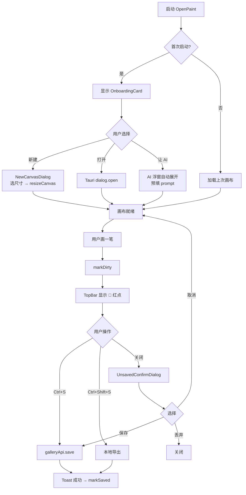
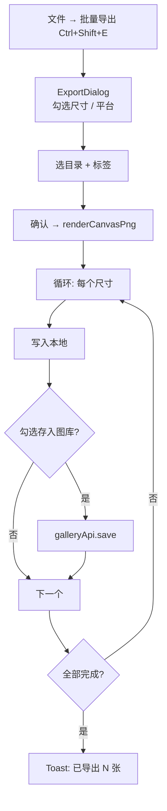

# OpenPaint · UX 与入门体验需求文档

**版本**：v0.1.0（草案）｜**状态**：待评审｜**作者**：前端 + 设计｜**最后更新**：2026-08-28

> 本文档对应 [docs/验收缺陷与建议.md](./验收缺陷与建议.md) §1 中尚未登记的体验类问题（UX-A01 ~ UX-A11），并将其从"缺陷登记"升级为"产品需求 + 验收标准 + 工作项"。
> 关联设计文档：[OpenPaint 前端设计说明书.md](../OpenPaint 前端设计说明书.md)、[OpenPaint 项目说明书.md](../OpenPaint 项目说明书.md)。
> 测试用例命名空间：`ONB-xxx`，与 [测试用例集.md](./测试用例集.md) 现有 `TC-*` 并列。

---

## 0. 背景与问题陈述

### 0.1 问题

OpenPaint 桌面版安装启动后，新用户看到的界面与传统画图软件（Paint.NET / Photoshop / Figma）存在巨大心智落差：

| 维度 | 传统画图软件 | OpenPaint 现状 |
| --- | --- | --- |
| 新建 / 打开 / 保存 | `文件` 菜单或显式按钮 | 无任何入口（见 `src-web/src/components/layout/TopBar.vue:50-101`） |
| 标题栏 | 显示当前文件名 + 未保存红点 | 仅显示 Logo + "OpenPaint" + "MVP" 徽标 |
| 主工具条 | 撤销/重做/缩放/新建图层/裁剪 | 仅显示"工具：brush"一行字 + 8 个色板 |
| 关闭未保存 | 弹"是否保存"对话框 | 直接退出，所有笔触丢失 |
| 画布空白 | 居中显示引导卡 | 纯白/灰空白 |
| AI 助理未配置 | 引导去设置 | 浮窗打开后是空状态，无 CTA |

用户面对的客观状态（截至本次需求评审）：

- `src-web/src/api/index.ts:208` 已有 `galleryApi.save`（Rust `save_to_gallery`），但 UI 完全没接。
- `src-web/src/composables/useShortcuts.ts:95` 的 `defaultBindings()` 没有 `Ctrl+N / Ctrl+O / Ctrl+S`。
- `src-web/src/components/canvas/CanvasToolbar.vue` 仅 67 行，主工具条几乎是空的。
- `src-web/src/components/layout/MainLayout.vue` 没有菜单栏组件。
- `OpenPaint 前端设计说明书.md` §11 承诺了 `Ctrl+C / Ctrl+V / Ctrl+A / Ctrl+D / Ctrl+Enter / F11`，代码里也都没实现。

### 0.2 影响

- 新用户首次启动到"画一笔"的成功路径被卡住，需要自己发现左工具栏。
- 画完想保存找不到入口 → 关闭应用丢失 → 投诉 / 弃用。
- 营销 Landing（`src-web/src/views/LandingView.vue`）承诺的"图层系统、蒙版、混合模式、一键导出多尺寸"在桌面端首次启动几乎看不到，会造成预期落差。
- 与 R-D04（README "功能矩阵"）联动：宣传里没标灰的能力，会让用户怀疑软件"是不是根本不能做"。

### 0.3 目标

把首次启动到"画一笔并保存到图库"的**主路径时间从 ≥5 分钟（用户研究摸索）压到 ≤60 秒（自带引导）**；把"用户首次启动后立即放弃率"作为关键指标跟踪（通过 `~/.openpaint/telemetry/onboarding.json` 本地文件记录，无外发）。

### 0.4 非目标（本期不做）

- 不引入完整 i18n 框架（R-T02），文案继续用中文，预留 `$t()` 风格字符串占位。
- 不重做主题切换（R-T03）。
- 不做云端备份（R-A03）。
- 不做端到端 Playwright 自动化（R-A04），但需为后续 W8 留好测试钩子。
- 不重做 4K 性能基线（R-N05）。

---

## 1. 用户故事（User Stories）

### US-1：首次启动引导

> **作为** 第一次启动 OpenPaint 的设计师
> **我希望** 看到清晰的"下一步"提示（新建画布 / 导入图片 / 让 AI 帮我画）
> **以便** 在 60 秒内完成第一次有意义操作

**验收标准**

- [ ] 画布空白且无历史时，中央显示引导卡（含三张选项卡）。
- [ ] 三张选项卡分别进入：新建画布向导、文件选择对话框、AI 助理浮窗并预设 prompt。
- [ ] 用户完成任一操作后，引导卡消失，且 24 小时内不再显示。
- [ ] 关闭后再打开，若 `~/.openpaint/canvas-state.json` 不存在历史，引导卡再次出现。

### US-2：新建画布向导

> **作为** 用户
> **我希望** 点击"新建"后能从预设尺寸 / 自定义尺寸二选一
> **以便** 快速开始适配目标平台的画图

**验收标准**

- [ ] 预设至少包含：`社交媒体 1080×1080`、`Web 横幅 1920×1080`、`A4 210×297mm (300dpi)`、`iOS App Icon 1024×1024`、`自定义…`。
- [ ] 自定义模式可输入宽 × 高（像素或 mm），并选择 DPI（72 / 144 / 300）。
- [ ] 取消时画布状态不变；确认后调用 `canvasApi.resizeCanvas(w, h)` 并 `canvasStore.resetView()`。
- [ ] 旧图层处理：弹窗询问"保留现有图层并裁切 / 丢弃新建空白 / 取消"。

### US-3：打开本地图片

> **作为** 用户
> **我希望** 通过菜单 / 工具按钮 / 拖拽 / `Ctrl+O` 打开本地 PNG / JPG / WebP / SVG
> **以便** 把现有素材导入画布

**验收标准**

- [ ] 调用 Tauri `dialog.open`，过滤类型 `[png, jpg, jpeg, webp, svg]`。
- [ ] 读取文件 → Base64 → `canvasApi.pasteImage` 落入当前活动层。
- [ ] 失败（格式不支持 / 文件超大 / 权限）弹 Toast 提示并保留原画布。
- [ ] 主画布区域支持拖拽文件 → 显示"松手导入"覆盖层。

### US-4：保存到图库（主流程）

> **作为** 用户
> **我希望** 画完后一键保存到图库，可选打标签
> **以便** 后续语义召回 / 批量导出

**验收标准**

- [ ] TopBar 出现 `💾` 按钮，未保存变更时右上角带红点。
- [ ] 点击触发 `galleryApi.save({ imageData, tags: [], source: 'imported' })`，成功后弹"已保存到图库"Toast，跳转到 Gallery 右窗。
- [ ] `Ctrl+S` 等价于按钮；`Ctrl+Shift+S` 弹出"另存为…"对话框选择本地路径。
- [ ] 保存期间按钮 disabled 并显示 spinner；失败时弹 Toast 且红点不消失。

### US-5：另存为本地文件

> **作为** 用户
> **我希望** 把画布另存为本地 PNG / JPG / WebP
> **以便** 用于其他工具 / 上传平台

**验收标准**

- [ ] 菜单项"文件 → 导出 → PNG / JPG / WebP"，`Ctrl+E` 直接弹出导出对话框。
- [ ] JPG / WebP 弹出质量滑块（默认 90）。
- [ ] 调用 `canvasApi.renderCanvasPng()` 拿 Base64 → Tauri `dialog.save` 选路径 → 写入。
- [ ] 写入失败弹错误 Toast，但保持应用运行。

### US-6：未保存提示与关闭确认

> **作为** 用户
> **我希望** 关闭应用 / 关闭画布时若未保存有明确提示
> **以便** 避免误操作丢画

**验收标准**

- [ ] 任何会修改画布的 IPC 调用成功后，标记 `isDirty = true`。
- [ ] 关闭应用 / 关闭画布 / 路由离开时若 `isDirty`，弹"保存 / 丢弃 / 取消"三选项。
- [ ] 选保存走 US-4；选丢弃直接关闭；选取消中断关闭。
- [ ] Tauri 侧通过 `getCurrentWindow().onCloseRequested` 拦截，前端通过 `e.preventDefault()` 弹确认。

### US-7：左工具栏快捷键提示

> **作为** 用户
> **我希望** 鼠标悬停工具按钮时看到工具名 + 快捷键
> **以便** 学会键盘操作

**验收标准**

- [ ] 按钮底部右下角显示单字母快捷键（如 `B`、`E`）。
- [ ] tooltip 显示"画笔 (B)"、`按住 Shift 反相` 等提示。
- [ ] 主题为深色时快捷键字符使用 `--text-muted`，选中态使用 `--accent`。

### US-8：AI 助理空状态引导

> **作为** 还没配置 LLM Key 的用户
> **我希望** 打开 AI 助理浮窗看到清晰的下一步
> **以便** 知道去哪配 Key

**验收标准**

- [ ] 浮窗空状态显示："AI 助理未启用 · [打开设置]"与一行说明"需要先配置 OpenAI / Claude / DeepSeek / Ollama 之一"。
- [ ] 点击"打开设置"直接弹 `SettingsModal` 并高亮 LLM provider 选择区。
- [ ] 配置成功后回到浮窗，看到快捷 prompt 模板（"设计蓝色科技风 Logo"、"把背景改成森林"、"导出一组 iOS 图标"）三张卡片，点击填入输入框。

### US-9：导出多尺寸（承接 README 主打卖点）

> **作为** 设计师
> **我希望** 一键把当前画布导出为多尺寸 PNG（如 iOS 全套 / Web 全套）
> **以便** 不必为每个尺寸单独操作

**验收标准**

- [ ] "文件 → 批量导出"打开对话框，预设三组：iOS（20, 29, 40, 60, 76, 83.5, 1024）、Android（48, 72, 96, 144, 192, 512）、Web（16, 32, 48, 180, 192, 512）。
- [ ] 用户可勾选 / 取消单个尺寸。
- [ ] 选中"同时存入图库"后，每张调 `galleryApi.save`，统一打标签（如 `iOS` / `V2.0`）。
- [ ] 导出过程显示进度条（X / N），全部完成后弹"已导出 N 张到 `<path>` / 已存入图库"。

### US-10：快捷键补齐

> **作为** 任何用户
> **我希望** 业界通用的画图快捷键默认生效
> **以便** 与既有肌肉记忆一致

**验收标准**

| 快捷键 | 功能 | 实现方式 |
| --- | --- | --- |
| `Ctrl+N` | 新建画布向导 | 调用 `uiStore.openNewCanvasDialog()` |
| `Ctrl+O` | 打开本地图片 | 调用 Tauri `dialog.open` |
| `Ctrl+S` | 保存到图库 | 触发 `galleryApi.save` |
| `Ctrl+Shift+S` | 另存为本地 | `dialog.save` |
| `Ctrl+E` | 导出 PNG | `dialog.save`，格式 PNG |
| `Ctrl+Shift+E` | 批量导出 | 打开批量导出对话框 |
| `Ctrl+Z` / `Ctrl+Y` / `Ctrl+Shift+Z` | 撤销 / 重做 | 已实现 ✅（仅需文档与测试） |
| `Ctrl+A` | 全选 | `canvasApi.setRectSelection({0,0,W,H})` |
| `Ctrl+D` | 取消选区 | `canvasApi.clearSelection()` |
| `Ctrl+C` / `Ctrl+V` | 复制 / 粘贴 | OS 剪贴板（暂仅 PNG），需 `tauri-plugin-clipboard-manager` |
| `+` / `-` | 缩放 | `canvasStore.setZoom(z * 1.2)` / `/1.2` |
| `0` | 缩放至 100% | `canvasStore.setZoom(1)` |
| `Ctrl+0` | 适配窗口 | `canvasStore.fitToWindow` |
| `Space` + 拖拽 | 平移画布 | `CanvasView` 内监听 |
| `F11` | 全屏 | Tauri `getCurrentWindow().setFullscreen(true)` |
| `?` | 打开快捷键速查面板 | 弹 Modal，列出全部快捷键 |

### US-11：可访问性最小集

> **作为** 屏幕阅读器 / 仅键盘用户
> **我希望** 主按钮可被 Tab 聚焦、按钮带 ARIA label
> **以便** 不被排除在外

**验收标准**

- [ ] TopBar / LeftSidebar / 主菜单所有按钮具备 `aria-label`。
- [ ] 焦点环显式（`:focus-visible` 样式不依赖鼠标）。
- [ ] 弹窗遵循 WAI-ARIA Modal 模式（焦点陷阱 + Esc 关闭）。
- [ ] 状态变更（保存成功 / 失败）使用 `aria-live="polite"` 区域通报。

---

## 2. 信息架构（IA）与全局导航

### 2.1 新增菜单栏

在 `MainLayout.vue` 的 `top-bar` 与原 `TopBar.vue` 之间插入 `AppMenuBar.vue`（MVP 用下拉按钮，后期可换原生菜单）：

```
┌──────────────────────────────────────────────────────────────────────────┐
│ OpenPaint   未命名 · 已修改●       [文件 ▾] [编辑 ▾] [视图 ▾] [帮助 ▾]   │
│                                              ↶ ↷ │ ⚡ 🖼️ │ ⚙             │
└──────────────────────────────────────────────────────────────────────────┘
```

**文件 ▾**

- 新建画布… （Ctrl+N）
- 打开… （Ctrl+O）
- ──────────
- 保存到图库 （Ctrl+S）
- 另存为… （Ctrl+Shift+S）
- 导出 → PNG / JPG / WebP （Ctrl+E）
- 批量导出… （Ctrl+Shift+E）
- ──────────
- 最近文件 ▾ （保留最近 10 个本地导出）
- ──────────
- 退出 （Alt+F4）

**编辑 ▾**

- 撤销 （Ctrl+Z）
- 重做 （Ctrl+Y）
- ──────────
- 全选 （Ctrl+A）
- 取消选区 （Ctrl+D）
- ──────────
- 复制 （Ctrl+C） / 粘贴 （Ctrl+V）

**视图 ▾**

- 100% （Ctrl+0）
- 适配窗口 （Ctrl+0 + Shift）
- 放大 / 缩小 （+ / -）
- ──────────
- 切换右窗：OpenPencil / 图库 / 折叠
- 切换主题：深色 / 浅色
- ──────────
- 全屏 （F11）

**帮助 ▾**

- 快捷键速查… （?）
- 入门引导（强制重新触发）
- 关于 OpenPaint
- 报告问题（跳 GitHub Issues）
- 文档（跳 GitHub README）

### 2.2 标题栏新增元素

```
[Logo] OpenPaint   [文件 ▾] [编辑 ▾] [视图 ▾] [帮助 ▾]
                  └─ "未命名 · 已修改●"   (中央)
                  └─ "未命名.png"        (已保存后)
```

文件名后缀星号规则：

- `已修改●` —— 红色 8px 圆点 + 文字"已修改"
- `未保存…` —— 黄底 + spinner（保存进行中）
- `已保存 ✓` —— 绿勾，2 秒后淡出到文件名
- `已导出` —— 蓝底，导出完成时短暂显示

### 2.3 快捷键速查 Modal

触发：`?` 或"帮助 → 快捷键速查"。

内容：分组的快捷键表格（与 §1 US-10 一致），底部"打印此页"链接。Esc 关闭。

---

## 3. 组件契约

### 3.1 新增组件清单

| 组件 | 路径 | 职责 |
| --- | --- | --- |
| `AppMenuBar.vue` | `components/layout/AppMenuBar.vue` | 顶部菜单栏，托管所有菜单下拉 |
| `FileMenu.vue` / `EditMenu.vue` / `ViewMenu.vue` / `HelpMenu.vue` | `components/layout/menus/` | 各菜单下拉内容 |
| `OnboardingCard.vue` | `components/onboarding/OnboardingCard.vue` | 画布空白引导卡 |
| `NewCanvasDialog.vue` | `components/canvas/NewCanvasDialog.vue` | US-2 新建画布向导 |
| `ExportDialog.vue` | `components/canvas/ExportDialog.vue` | US-5 / US-9 导出对话框 |
| `UnsavedConfirmDialog.vue` | `components/common/UnsavedConfirmDialog.vue` | US-6 关闭确认 |
| `KeyboardCheatsheet.vue` | `components/help/KeyboardCheatsheet.vue` | US-10 快捷键速查 |
| `Toast.vue` / `useToast.ts` | `components/common/Toast.vue`、`composables/useToast.ts` | 顶部右下角通知 |

### 3.2 关键组件 API

#### `useOnboarding()`

```ts
// composables/useOnboarding.ts
export interface OnboardingState {
  completed: boolean;
  lastShownAt: number | null;
  dismissedHints: string[]; // 已经看过的 hint id
}

export function useOnboarding(): {
  state: Ref<OnboardingState>;
  shouldShowMainCard: ComputedRef<boolean>;
  markCompleted: () => void;
  dismissHint: (id: string) => void;
  reset: () => void; // 帮助菜单触发
};
```

持久化键：`openpaint:onboarding`，存 `~/.openpaint/state.json`。

#### `useDocumentState()`

```ts
// composables/useDocumentState.ts
export type SaveState = 'pristine' | 'dirty' | 'saving' | 'saved' | 'exported';

export function useDocumentState(): {
  state: Ref<SaveState>;
  fileName: Ref<string>;
  isDirty: ComputedRef<boolean>;
  markDirty: () => void;
  markSaving: () => void;
  markSaved: (fileName?: string) => void;
  markExported: () => void;
  requestClose: () => Promise<'save' | 'discard' | 'cancel'>;
};
```

#### `useToast()`

```ts
// composables/useToast.ts
export type ToastKind = 'info' | 'success' | 'warn' | 'error';

export interface Toast {
  id: string;
  kind: ToastKind;
  message: string;
  durationMs?: number; // 默认 3000
  action?: { label: string; onClick: () => void };
}

export function useToast(): {
  toasts: Ref<Toast[]>;
  show: (t: Omit<Toast, 'id'>) => string;
  dismiss: (id: string) => void;
};
```

#### `NewCanvasDialog`

```ts
// components/canvas/NewCanvasDialog.vue
defineProps<{
  open: boolean;
  currentSize: { w: number; h: number };
}>();
defineEmits<{
  (e: 'update:open', v: boolean): void;
  (e: 'confirm', v: { w: number; h: number; unit: 'px' | 'mm'; dpi: number; handleLayers: 'crop' | 'discard' | 'cancel' }): void;
}>();
```

### 3.3 与现有 store / API 的关系

| 需求项 | 触发的 store action | 触发的 API |
| --- | --- | --- |
| US-2 新建 | `canvasStore.resetView()` | `canvasApi.resizeCanvas(w, h)` |
| US-3 打开 | `canvasStore.activeLayerId` 不变 | `canvasApi.pasteImage(base64)` |
| US-4 保存到图库 | `galleryStore.prepend()` | `galleryApi.save({ imageData, tags, source: 'imported' })` |
| US-5 另存为 | — | `canvasApi.renderCanvasPng()` + Tauri `dialog.save` |
| US-6 关闭拦截 | `useDocumentState().requestClose()` | `getCurrentWindow().onCloseRequested` |
| US-10 快捷键 | 各自 store action | 现有 + 新增 |

---

## 4. 文案规范（Copy Spec）

### 4.1 原则

- 一句话讲清"做完会怎样"，不堆术语。
- 中文为主，专有名词（Paint.NET / SVG / PSD）保留英文。
- 错误文案给"下一步"，不只说"出错了"。

### 4.2 关键文案表

| 场景 | 文案 | 备选（避免） |
| --- | --- | --- |
| 新建引导卡主标题 | "从一张画布开始" | "Create new document" |
| 新建引导卡副标题 | "选个尺寸，或让 AI 帮你定" | "Start a new project" |
| 打开按钮 tooltip | "打开图片 (Ctrl+O)" | "Open file" |
| 保存按钮 tooltip（已修改） | "保存到图库 (Ctrl+S) · 1 处未保存改动" | "Save" |
| 保存按钮 tooltip（已保存） | "已保存到图库 · 3 分钟前" | "Saved" |
| 另存为菜单 | "另存为 PNG 到本地…" | "Export as…" |
| 导出失败 Toast | "导出失败：磁盘空间不足。请清理后重试。" | "Export failed." |
| 关闭未保存对话框 | "这份画布还没保存。要继续吗？" | "You have unsaved changes." |
| 关闭对话框按钮 | `[保存到图库] [丢弃] [取消]` | `[Save] [Don't Save] [Cancel]` |
| AI 助理空状态标题 | "AI 助理还没启用" | "AI not configured" |
| AI 助理空状态副文 | "需要先配置一个大模型（OpenAI / Claude / DeepSeek / Ollama），AI 才能帮你画。" | "Please configure LLM." |
| AI 助理空状态 CTA | `[打开设置]` | `[Configure]` |
| 快捷键速查标题 | "快捷键速查" | "Keyboard shortcuts" |

### 4.3 ARIA label 模板

```ts
// 工具按钮
aria-label="{工具中文名}（快捷键 {KEY}）"
// 例：aria-label="画笔（快捷键 B）"

// 状态指示
aria-label="未保存改动，点击保存或按 Ctrl+S"
```

---

## 5. 空状态 & 错误状态

### 5.1 画布空状态（OnboardingCard）

```
┌─────────────────────────────────────────┐
│                                         │
│         🎨 从一张画布开始               │
│   选个尺寸开始，或让 AI 帮你定          │
│                                         │
│   ┌───────────┐ ┌───────────┐ ┌────────┐ │
│   │ + 新建     │ │ 📂 打开   │ │ ✨ 让 AI│ │
│   │  1080×1080 │ │  本地图片  │ │  来画   │ │
│   └───────────┘ └───────────┘ └────────┘ │
│                                         │
│   上次：2026-08-27 你创建了一张          │
│   1920×1080 的画布  [继续编辑]            │
│                                         │
└─────────────────────────────────────────┘
```

规则：

- 仅在 `canvasStore.layerList.length === 0` 且 `!useDocumentState().isDirty` 时显示。
- 点击卡片外画布区域不消失；点击选项卡进入对应流程后消失。
- 24 小时内（基于 `lastShownAt`）不重复显示。

### 5.2 AI 助理空状态

```
┌─────────────────────────────┐
│  AI 助理还没启用             │
│                             │
│  需要先配置一个大模型        │
│  （OpenAI / Claude /        │
│  DeepSeek / Ollama），      │
│  AI 才能帮你画。             │
│                             │
│  [打开设置]                  │
└─────────────────────────────┘
```

### 5.3 图库空状态

```
┌─────────────────────────────┐
│  图库还是空的                │
│                             │
│  试试 [新建画布] 或          │
│  把你正在画的画布            │
│  保存到图库 (Ctrl+S)         │
└─────────────────────────────┘
```

### 5.4 错误状态对照表

| 场景 | 提示文案 | 处理建议 |
| --- | --- | --- |
| LLM Key 失效 | "API Key 无效，请到设置更新" | 弹 Toast + 自动打开 SettingsModal |
| Tauri IPC 失败 | "与后端通信失败：{err.message}" | 自动重试 1 次，仍失败则弹 Modal |
| 文件过大 (>50MB) | "图片超过 50MB，请压缩后再打开" | 弹 Toast，按钮保留可重试 |
| 格式不支持 | "{ext} 暂不支持，可转 PNG / JPG / SVG 后再试" | 弹 Toast |
| 写文件无权限 | "没有写入权限：{path}" | 弹 Toast，建议改路径 |
| 磁盘空间不足 | "磁盘空间不足，请清理后重试" | 弹 Toast，按钮 disabled 5 秒 |
| 撤销栈满 | "已到达历史记录上限（50 步）" | 仅 statusbar 提示，不弹窗 |

---

## 6. 交互流程图（关键路径）

### 6.1 首次启动 → 画第一笔 → 保存



### 6.2 批量导出（README 主打场景）



---

## 7. 测试用例矩阵（ONB-xxx）

> 与 [docs/测试用例集.md](./测试用例集.md) 现有 TC-* 编号体系并列。前端 Vitest + 组件测试（W7 引入 `@vue/test-utils` 之后落地，详见 R-A01）。

### ONB-1xx · 启动与引导

| ID | 用例 | 期望 |
| --- | --- | --- |
| ONB-101 | 全新 `~/.openpaint` 启动 | OnboardingCard 显示 |
| ONB-102 | 24h 内第二次启动 | OnboardingCard 不显示 |
| ONB-103 | 画布非空（layerList.length > 0）启动 | OnboardingCard 不显示 |
| ONB-104 | "帮助 → 入门引导" | OnboardingCard 强制显示 |
| ONB-105 | 点击 "+ 新建" → 取消 | 画布不变，OnboardingCard 仍可显示 |

### ONB-2xx · 文件菜单

| ID | 用例 | 期望 |
| --- | --- | --- |
| ONB-201 | `Ctrl+N` | NewCanvasDialog 弹出 |
| ONB-202 | NewCanvasDialog 选 1080×1080 + 保留图层裁切 | resizeCanvas 调用，参数正确 |
| ONB-203 | `Ctrl+O` 选 PNG | pasteImage 成功，新图层激活 |
| ONB-204 | `Ctrl+O` 选 .psd | Toast 错误，文件不导入 |
| ONB-205 | 主画布拖拽 PNG | 显示"松手导入"覆盖层，松手导入成功 |
| ONB-206 | 主画布拖拽 .txt | 显示"不支持的格式"覆盖层 |

### ONB-3xx · 保存 / 导出 / 关闭

| ID | 用例 | 期望 |
| --- | --- | --- |
| ONB-301 | 画一笔 → `Ctrl+S` | galleryApi.save 调用，Toast 成功，红点消失 |
| ONB-302 | 画一笔 → `Ctrl+Shift+S` | dialog.save 弹出，可写本地 PNG |
| ONB-303 | 导出 JPG 质量滑块 70 | 写入文件大小 < 90 质量 |
| ONB-304 | 未保存时关闭窗口 | UnsavedConfirmDialog 弹出 |
| ONB-305 | 未保存对话框选"丢弃" | 窗口关闭，画布丢弃 |
| ONB-306 | 未保存对话框选"取消" | 窗口不关，画布不变 |
| ONB-307 | 保存到图库失败（数据库写异常） | Toast 错误，红点保留，按钮可重试 |
| ONB-308 | 批量导出 iOS 全尺寸 + 存入图库 | 7 个文件落地 + 7 条 gallery 记录，标签一致 |

### ONB-4xx · 快捷键

| ID | 用例 | 期望 |
| --- | --- | --- |
| ONB-401 | `?` 键 | KeyboardCheatsheet 弹出 |
| ONB-402 | `Ctrl+Z` 连续按 3 次 | 撤销 3 步，canUndo 状态正确 |
| ONB-403 | 输入框聚焦时按 `B` | 不切换工具（whenEditable 规则） |
| ONB-404 | `Ctrl+0` | 缩放至 100%，pan 归零 |
| ONB-405 | `F11` | 窗口全屏切换 |
| ONB-406 | `Ctrl+E` 未配置 LLM | 导出对话框仍可打开（与 LLM 无关） |

### ONB-5xx · 可访问性 & 文案

| ID | 用例 | 期望 |
| --- | --- | --- |
| ONB-501 | Tab 键从 Logo 移到第一个按钮 | 焦点环可见 |
| ONB-502 | 屏幕阅读器读 OnboardingCard 标题 | 朗读"从一张画布开始" |
| ONB-503 | Esc 关闭任意 Modal | 焦点回到触发按钮 |
| ONB-504 | 保存成功 Toast | aria-live 区域朗读"已保存到图库" |
| ONB-505 | 深色 / 浅色切换 | 所有新增按钮颜色符合 token |

---

## 8. 度量（Metrics）

> 全部本地记录到 `~/.openpaint/telemetry/onboarding.json`，**不外发**，仅在"反馈问题"时可由用户选择附带导出。

| 指标 | 定义 | 目标 |
| --- | --- | --- |
| 首次激活到首次操作时间 | 启动 → 第一次点击 / 第一次笔触 | ≤60s |
| 首次保存成功率 | 首启动后 24h 内出现 `Ctrl+S` 且成功的比例 | ≥70% |
| 引导卡片完成率 | 三选项中任一被点击且走通 | ≥80% |
| 关闭未保存触发率 | isDirty=true 时窗口关闭触发弹窗的比例 | =100% |
| 快捷键使用率 | 7 天内使用 ≥1 次 `Ctrl+N/O/S/E` 的用户 | ≥40% |
| 批量导出使用率 | 7 天内使用 ≥1 次批量导出的用户 | ≥10% |

---

## 9. 风险与权衡

### R-1：菜单栏 vs 原生 Tauri menu

- 方案 A：HTML/CSS 下拉菜单（本期采用）
  - ✅ 跨平台一致、易迭代
  - ❌ 桌面菜单栏体验略弱
- 方案 B：Tauri 原生 menu（`tauri::menu`）
  - ✅ OS 原生体验
  - ❌ Windows / macOS / Linux 表现差异大，与 WebView 内下拉样式协调难

### R-2：保存语义

- 方案 A：默认 `Ctrl+S` 保存到图库
  - ✅ 与 AI 协作流闭环最自然
  - ❌ 与"画图软件保存为本地文件"心智冲突
- 方案 B：默认 `Ctrl+S` 保存到本地
  - ✅ 与 Paint.NET 一致
  - ❌ 破坏 README 主打的"自动归档图库"叙事
- **本期选择 A**，并在"文件 → 保存到本地"提供并列入口；下个里程碑引入"设置 → 保存默认行为"让用户切换。

### R-3：自动保存

- 是否要在 isDirty 后每 30 秒自动保存到图库？
- 决定：**不做**（避免污染图库、增加用户疑惑）。本期仅按用户主动触发。
- 替代方案：在 US-6 关闭拦截里提供"记住选择：下次不再询问"复选框。

### R-4：与 R-A01（组件测试）联动

- 本文档定义的 ONB-xxx 用例中，组件级（OnboardingCard / NewCanvasDialog / ExportDialog / UnsavedConfirmDialog）依赖 W7 引入 `@vue/test-utils` 后落地。
- composable 级（useOnboarding / useDocumentState / useToast）可在 W7 立即补 Vitest。

---

## 10. 落地计划（与 kanban 对齐）

> 同步至 [docs/kanban.md](./kanban.md) 的 W7 / W8 backlog。

### W7（建议 5 个工作日）

- [ ] ONB-CORE-01：`useDocumentState` / `useOnboarding` / `useToast` 三个 composable + Vitest
- [ ] ONB-CORE-02：Toast 组件 + AppMenuBar 组件骨架
- [ ] ONB-CORE-03：File / Edit / View / Help 四个菜单下拉（含键盘快捷）
- [ ] ONB-CORE-04：TopBar 新增 💾 按钮 + 标题栏未保存指示器
- [ ] ONB-UX-01：OnboardingCard + NewCanvasDialog
- [ ] ONB-A11Y-01：aria-label 批量补齐 + focus-visible 样式

### W8（建议 5 个工作日）

- [ ] ONB-IO-01：US-3 打开本地图片（Tauri dialog.open + pasteImage）
- [ ] ONB-IO-02：US-4 保存到图库按钮 + Ctrl+S
- [ ] ONB-IO-03：US-5 另存为本地 PNG / JPG / WebP
- [ ] ONB-IO-04：US-9 批量导出
- [ ] ONB-CLOSE-01：US-6 未保存拦截
- [ ] ONB-ONB-01：US-8 AI 助理空状态引导
- [ ] ONB-HELP-01：US-10 KeyboardCheatsheet
- [ ] ONB-TEST-01：补 ONB-xxx 用例的 Vitest + 组件测试（依赖 R-A01）

### W9（验证与发布）

- [ ] ONB-METRIC-01：本地遥测写入 `~/.openpaint/telemetry/onboarding.json`
- [ ] 录屏：首次启动 60 秒主路径
- [ ] 录屏：批量导出 iOS 全尺寸

---

## 11. 关联文档

- [OpenPaint 项目说明书.md](../OpenPaint 项目说明书.md) §4.1、§4.4、§6 — 功能描述与里程碑
- [OpenPaint 前端设计说明书.md](../OpenPaint 前端设计说明书.md) §6、§11 — 组件架构与快捷键承诺
- [OpenPaint 技术设计文档.md](../OpenPaint 技术设计文档.md) — `save_to_gallery` / `paste_image_to_layer` / `resize_canvas` IPC 契约
- [docs/kanban.md](./kanban.md) — W7/W8 排期
- [docs/验收缺陷与建议.md](./验收缺陷与建议.md) — 本需求对应的 R-A01 / R-D04 / R-T04 缺陷条目
- [docs/测试用例集.md](./测试用例集.md) — TC-* 用例与 ONB-* 用例并列

---

## 12. 变更日志

| 版本 | 日期 | 变更 |
| --- | --- | --- |
| v0.1.0 | 2026-08-28 | 初稿（11 个用户故事 + IA + 组件契约 + 文案 + 测试矩阵 + 落地计划） |

---

> 评审签字

| 角色 | 签字 | 日期 | 备注 |
| --- | --- | --- | --- |
| 产品 Owner | _____ | _____ | 范围与优先级 |
| 前端 Lead | _____ | _____ | 组件拆分 / 排期 |
| 设计 Lead | _____ | _____ | 文案 / 空状态 / IA |
| 测试 Lead | _____ | _____ | ONB-xxx 用例覆盖 |
